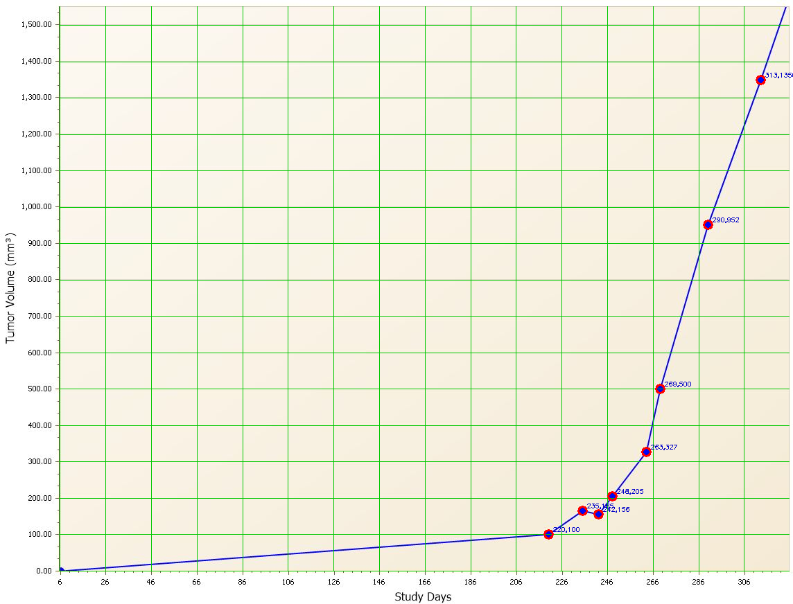

# Line-graph data-marker extractor

Reads images of tumour growth-curve line graphs and extracts the **(x, y) data
values of the data markers** (the plotted measurement points), ignoring the
interpolating line between them. Designed to be reliable across the dataset
despite different background colours, line colours, marker symbols (circle /
square / triangle) and line weights (thin / bold).

## Verification

```bash
python tests/verify_system.py    # asserts all 44 images pass
```

Checks every image calibrates, calibration residuals are small, all marker
values fall within the plotted axis range, and a non-trivial number of markers
is found. Result: **44 images, 760 markers, 0 failures**.

`experiments/verify.py` produces human-readable **grid overlays**: it redraws
each image with the *calibrated* grid (green lines placed at tick values from the
fitted transform) and the detected markers (red circles labelled with their
extracted `x,y`). If the green grid lands on the chart's own printed gridlines
the calibration is right; if the red circles sit on the plotted points the
detection is right. Example on a `single_curve` image:



The green calibrated grid coincides with the printed gridlines and the red
markers land on the plotted points; the near-zero baseline points are the
documented y=0 limitation below.

Markers bisected by a plot boundary lose the thickness the prominence test needs
and are recovered with three boundary-specific passes (see `METHODS.md` §2.1):
- **Right edge** (final study-day point): `series_mask` keeps the frame column so
  the half-symbol survives, and a de-dupe keeps the strongest peak there.
- **Left spine** (day-0 point, `x = x_min`): always present in a growth curve, so
  if none was detected in the spine band its thickest blob is recovered.
- **Origin corner** (`x = x_min, y ≈ 0`, quartered by *both* axes): recovered via
  a colour mask (drops the grey spine) + vertical opening (drops the thin line) +
  a thickness/roundness gate, confined to the corner so no false positives are
  added. This lifted origin recall **33 % → ~96 %** with zero added FPs (verified
  on synthetic and the 44 real images).
- **Top edge cut-off** (plots cropped right at the cream, with no margin above):
  `find_spines` walks the box top up through the cream to the true cut edge,
  instead of stopping one gridline early and clipping the highest data point. This
  recovered a real top marker on **~140 / 3133** single-curve images (the marker
  is then detected normally). A point whose value exceeds the axis maximum — where
  the line simply *exits* the top of the plot — is correctly left undetected
  (its value is off-chart); an earlier "terminus recovery" that guessed a point
  there was removed for hallucinating.

### Known limitations
- **Interior-x markers on the y=0 baseline** (mid-plot, volume ≈ 0) are detected
  ~67 % of the time. The still-missed ones are tiny and near-identical to the
  axis line; recovering them re-admits the line as false positives at curve
  lift-off points, so they are accepted as low-value noise (the day-0 baseline
  point *is* recovered, above). See `experiments/notes/origin-spine-recovery-investigation.md`.
- A marker fused with the very top frame line (a point at the chart's ceiling)
  can be missed in rare cases.

## Accuracy

Because the real graphs have no ground-truth coordinates, accuracy is
established on a **synthetic benchmark** whose style is sampled from the real
`single_curve` images and whose marker coordinates are known exactly. The
generator is matched to the real distribution (left = real, right = synthetic):


On N=500 synthetic graphs the full pipeline recovers the **growth trajectory**
(AUC, peak, timing) to well under 1 % of axis span on graphs that calibrate, and
recovers the growth-curve AUC within 5 % of truth on 89 % of all graphs counting
every failure mode. See [`METHODS.md`](METHODS.md) for the full validity argument
and `experiments/notes/synthetic_benchmark_results.md` for the raw numbers.

## Table of Contents

- [Verification](#verification)
- [Accuracy](#accuracy)
- [Install](#install)
- [Usage](#usage)
  - [Use it from Python](#use-it-from-python)
- [How it works](#how-it-works)

## Install

Works on **Linux, macOS, and Windows** (Python ≥ 3.9). Two steps: a Python
virtual environment, and the native **Tesseract** OCR engine used for axis labels.

**1. Python environment** — create a venv, activate it, install the deps:

```bash
# macOS / Linux
python3 -m venv .venv
source .venv/bin/activate
pip install -r requirements.txt
```

```powershell
# Windows (PowerShell)
py -m venv .venv
.venv\Scripts\Activate.ps1
pip install -r requirements.txt
```

(On Windows `cmd.exe` use `.venv\Scripts\activate.bat`. If PowerShell blocks the
activation script, run `Set-ExecutionPolicy -Scope Process RemoteSigned` first.
On a **headless Linux** server `import cv2` may need system GL libs — `sudo apt
install libgl1 libglib2.0-0`, or `pip install opencv-python-headless` instead.)

**2. Tesseract OCR engine** (a system package, not a pip wheel):

| OS | command |
|----|---------|
| macOS (Homebrew) | `brew install tesseract` |
| Debian / Ubuntu | `sudo apt install tesseract-ocr` |
| Fedora / RHEL | `sudo dnf install tesseract` |
| Windows | install the [UB-Mannheim build](https://github.com/UB-Mannheim/tesseract/wiki), or `choco install tesseract` / `winget install tesseract-ocr.tesseract` |

The pipeline finds Tesseract on your `PATH`. If it isn't there (common on
Windows), point to the binary with the `TESSERACT_CMD` environment variable:

```bash
# macOS / Linux
export TESSERACT_CMD=/usr/local/bin/tesseract
```
```powershell
# Windows (PowerShell)
$env:TESSERACT_CMD = "C:\Program Files\Tesseract-OCR\tesseract.exe"
```

Verify the install: `tesseract --version`.

## Usage

With the venv **activated** (above), `python` is the venv's interpreter on every
OS. The CLI accepts a single image, a list of images, or a directory (a directory
is processed in parallel across CPU cores with a progress bar):

```bash
# a single chart  ->  writes output/chart.csv
python src/extract.py path/to/chart.jpeg

# several specific images at once
python src/extract.py a.jpeg b.png c.jpeg

# a whole directory (every *.jpeg/*.jpg/*.png/...), CSV + JSON + overlays
python src/extract.py Growth_Curves_NCI_BRCA --out output --format both --overlay

# JSON only, into a custom output dir
python src/extract.py Growth_Curves_NCI_BRCA --format json -o results/

# control parallelism: cap workers, or force sequential for debugging
python src/extract.py Growth_Curves_NCI_BRCA --workers 8
python src/extract.py Growth_Curves_NCI_BRCA --workers 1
```

> Paths use your shell's own separator — `Growth_Curves_NCI_BRCA` on every OS,
> or e.g. `data\charts\chart.jpeg` on Windows. Without activating the venv, call
> the interpreter directly: `.venv/bin/python …` (macOS/Linux) or
> `.venv\Scripts\python …` (Windows).

| flag | default | meaning |
|------|---------|---------|
| `-o, --out DIR` | `output` | output directory |
| `--format {csv,json,both}` | `csv` | per-image output format |
| `--overlay` | off | also write `overlays/<name>.png` (detected markers drawn on the image) |
| `--workers N` | all cores | worker processes; `1` runs sequentially |

Outputs (in `--out`, default `output/`):

| file | contents |
|------|----------|
| `<name>.csv` / `<name>.json` | extracted markers for one image: `x, y, pixel_x, pixel_y` |
| `all_markers.csv` | every marker from every image (`image, x, y`) |
| `summary.csv` | per-image status: marker count, calibration rms / inliers / tick step |
| `overlays/<name>.png` | detected markers drawn on the image (with `--overlay`) |

Example `output/chart.csv`:

```csv
x,y,pixel_x,pixel_y
7.09,5.46,84.3,476.7
14.11,12.26,116.0,474.0
22.98,30.08,156.0,467.0
```

### Use it from Python

`extract_image()` returns the markers plus calibration metadata for one image,
so the pipeline can be embedded without the CLI:

```python
import sys; sys.path.insert(0, "src")
from extract import extract_image

res = extract_image("path/to/chart.jpeg")
print(res["calibrated"], res["n_markers"])
for m in res["markers"]:
    print(m["x"], m["y"])          # data values; m["px"], m["py"] are pixels
```

## How it works

1. **Marker detection** (`src/markers.py`) — segment the series by darkness
   relative to the cream background OR by saturation (colour-agnostic), then
   find markers as **prominence peaks (h-maxima) of the distance transform**.
   The connecting line is a thin ridge that ascends to its endpoint markers, so
   it is never a regional maximum and produces no false peaks — even for bold
   lines. The prominence threshold (h=1.5) sits between line-rasterisation
   "staircase" noise (~1.2) and overlapping-marker prominence (~2.0), so dense
   overlapping markers are separated.
2. **Axis calibration** (`src/calibrate.py`) — OCR the axis tick labels
   (tesseract) and fit a robust linear pixel→value transform per axis by
   **RANSAC** (the line through some pair of tick labels that the most other
   labels agree with, within a quarter tick step, then a least-squares refit on
   those inliers), tolerant of occasional OCR misreads.
3. **Extraction** (`src/extract.py`) — map each marker pixel to (x, y).

