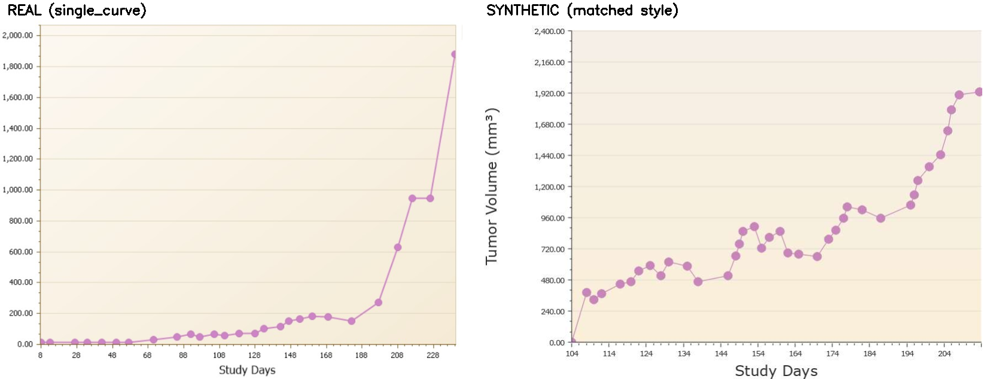

# Generative fidelity: how the synthetic benchmark reproduces the real graphs

The synthetic benchmark (`../synthetic_benchmark.py`) is only as trustworthy as
its resemblance to the real images. Because the 3,000+ `single_curve` targets are
produced by a *single charting tool* with a tight, regular style, that
resemblance can be made very close — the style space is small and reproducible,
unlike photographs or hand-drawn charts. Every generator parameter below was
**measured from the real images, not invented**, and the match was refined with
an iterative *render → compare-to-real → fix* loop.

`real_vs_synthetic.png` shows a real `single_curve` graph beside a style-matched
synthetic one:

## Engineered variables (and how each was sourced from the originals)

Values marked *(measure)* are reproduced by `../measure_real_style.py`; tick
density by `../ocr_yield_probe.py`.

| Element | Real | How the synthetic reproduces it |
|---|---|---|
| **Background** *(measure)* | cream vertical gradient inside the plot, white outside; BGR ≈ (232,244,250) top → (221,238,247) bottom | per-row linear interpolation between those two BGR values, with small jitter |
| **Aspect ratio / size** *(measure)* | W ≈ 620–1500; H ≈ 410–1100, taller images carrying more y-ticks | W sampled in range; **H derived from tick count** (fixed px/tick) so dense-tick graphs come out taller, as in the real data |
| **Curve distribution** | monotonic-ish tumour growth: near-zero early, convex rise | `linspace(0,1)**u`, `u∈[2,4]`; first point pinned at/near 0 |
| **Noise profile** | small run-to-run wobble on the curve | cumulative Gaussian jitter (`cumsum(N(0,0.04))`) |
| **Marker shapes** | circle, square, triangle, **star, ✕**, … (confirmed by sampling real crops) | one shape/graph from {circle, square, triangle, diamond, star, x, plus} |
| **Marker radius** *(measure)* | 4–9 px (distance-transform `dmax`) | sampled 4–9 px |
| **Line thickness** *(measure)* | 1–2 px (distance-transform `lw`) | sampled 1–2 px |
| **Markers / graph** *(measure)* | ≈6–45 | sampled 6–40 |
| **Colour palette** *(measure)* | magenta/violet, blue, red, orange, olive, teal, black | 8-colour palette covering that range |
| **Axis label format** | y: comma-thousands + `.00` (`1,600.00`); x: integer study-days | identical formatting |
| **Axis titles** | "Study Days"; rotated "Tumor Volume (mm³)" | same strings, incl. the ³ superscript |
| **Font rendering / aliasing** | a sans-serif TTF; by visual sampling labels read **predominantly smooth (anti-aliased)**, with a **minority hard/aliased ("8-bit")** tied to smaller/lower-res images | two modes, ~80% smooth / ~20% pixelated (biased so smaller images pixelate more). Smooth = anti-aliased Verdana (~15 px). Pixelated = ~9 px native Verdana, AA off (`fontmode="1"`), NEAREST-upscaled into clean blocks; 9 px is the legible floor (at 8 px the AA-off `0` degrades to a `D`) |
| **Label kerning** | normal screen-font spacing | labels drawn **per-character with 1 px letter-spacing** (`_label_tile`) so the comma/period stay separable. Without it, at ~9 px the punctuation fuses into the next digit and OCR reads `200.00` as `20000` (a ~100× scale error) — observed *in the full pipeline*, where adding the spacing raised calibration success from 27→34 / 40 (see `detection-failure-investigation.md`) |
| **Title legibility** | titles read smoother/larger than the aliased numbers | titles drawn anti-aliased and larger than the number labels |
| **Tick structure** | major + minor ticks (≈2 between y-labels, ≈4 between x-labels) | same layout; x-ticks drawn 1 px clear of the baseline so they aren't mis-detected as markers (see investigation §D) |
| **Tick density** *(yield)* | median ≈12.5 readable y-tick labels per axis | y-tick count tuned so synthetic OCR **yield** ≈ real (median ≈12) |
| **Edge effects** | first marker on y=0 baseline flattened/bisected; final marker bisected by the right image edge | baseline markers clipped at the axis; ~45% of graphs bleed to the right edge with a bisected final marker |
| **Compression** | mostly PNG but with visible JPEG-style artifacts | every image JPEG-encoded (q≈54–66) to bake in blocking/ringing |

## Provenance scripts (reproduce the values above)

- **`../measure_real_style.py`** — samples `single_curve` and reports the
  dimensions, background-gradient colours, marker radius, line width, markers per
  image, and series colours. Running it reproduces the exact numbers behind the
  `DIM_*`, `BG_TOP/BG_BOT`, `MARK_R`, `LINE_W`, `N_MARK`, `PALETTE` constants.
- **`../ocr_yield_probe.py`** — compares the OCR tick-yield of real vs synthetic
  images; used to tune synthetic tick density to the real distribution.
- **`detection-failure-investigation.md`** — the in-pipeline evidence for the
  kerning effect (the scale-misread and the 27→34/40 success change) and the
  baseline-tick false-positive fix.

> Note: `measure_real_style.py` and `ocr_yield_probe.py` are cleaned-up,
> re-runnable versions of one-off measurements taken during development; they
> were verified to land on the same values used to set the generator constants.

## Beyond visual: *functional* fidelity

Looking alike is necessary but not sufficient — the synthetic must also be **as
hard to process** as the real images, or the benchmark would flatter the method.
We therefore matched a functional metric, not just appearance: the synthetic
labels are tuned so the calibrator's **OCR tick-yield** lands in the real
distribution (synthetic median ≈12 vs real ≈12.5; `ocr_yield_probe.py`), so
synthetic calibration difficulty tracks real difficulty rather than being an
artifact of over- or under-degraded labels.

## Honest residual gaps

- Synthetic labels remain *marginally* harder to OCR than real (a few residual
  calibration misreads), so the synthetic calibration-failure rate is mildly
  **pessimistic** vs real.
- The generator and the detector's assumptions share an author, so a
  synthetic-only result risks circular validation; the synthetic numbers are
  therefore paired with human-overlay verification on the real images (real
  distribution; recall + gridline-level value sanity).
